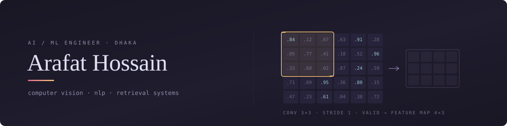
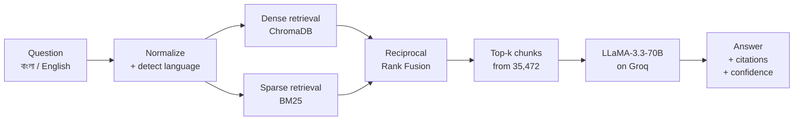
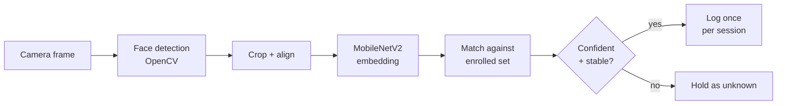

  

  
  
  
  <!-- Portfolio: uncomment and drop your URL in when the site is live
  
  -->

## Selected work

### LegalEase BD

  
  
  
  

- Bilingual legal assistant answering questions on Bangladeshi law in Bangla or English, cited to Act and Section
- Hybrid retrieval over 35,472 statute chunks: BM25 and ChromaDB run in parallel, merged by Reciprocal Rank Fusion, so casual Bangla still reaches formal legal wording
- Seven stage pipeline: language detection, intent classification, anti hallucination prompting, citation extraction
- FastAPI on Modal serverless GPU with a React frontend, 1 to 2s warm latency at near zero idle cost

<b>Pipeline</b>

  

**Stack:** `Python` · `FastAPI` · `Modal` · `Groq` · `ChromaDB` · `Sentence-Transformers` · `BM25` · `LangChain` · `React` · `Vite`

**Repo:** [LegalEase-BD](https://github.com/Hossain-Arafat/LegalEase-BD)

### DeepAttend

  
  
  
  

- Real time webcam attendance built for ordinary classroom hardware, no GPU
- MobileNetV2 fine tuned by transfer learning to recognise 50+ enrolled people
- Confidence threshold plus a stability window across frames, so no single frame can trigger a match
- Session safe CSV logging, one record per person however often they pass the camera

<b>Pipeline</b>

**Stack:** `Python` · `TensorFlow` · `Keras` · `OpenCV` · `MobileNetV2` · `Tkinter`

**Repo:** [deepattend-face-recognition](https://github.com/Hossain-Arafat/deepattend-face-recognition)

### PizzaGo

  
  
  
  

- Full stack PHP ordering platform on MVC, with separate controllers for auth, cart, orders, and inventory
- Three roles with their own dashboards, including live order status
- Normalised MySQL schema with cascading foreign keys, so deletes leave no orphaned rows

**Stack:** `PHP` · `MySQL` · `JavaScript` · `HTML` · `CSS` · `Apache`

**Repo:** [PizzaGo](https://github.com/Hossain-Arafat/PizzaGo)

## Tools

  
  
  
  
  
  
  
   
  
  
  
  
  
  
  

<b>Everything else</b>

 

| | |
|---|---|
| **Languages** | Python, C++, C#, SQL, JavaScript, PHP |
| **NLP and retrieval** | Sentence-Transformers, BM25, Groq API, Reciprocal Rank Fusion |
| **Data** | NumPy, Pandas, Matplotlib, Seaborn, Jupyter |
| **Web** | React, Vite, Tailwind, REST APIs, HTML, CSS, Apache |
| **Demos and serving** | Gradio, Streamlit, Modal, Docker |
| **Databases** | MySQL, SQL Server, ADO.NET |

 

---

  Open to AI/ML engineering roles and research collaboration. <a href="mailto:ar.hossain1303@gmail.com">get in touch</a>

